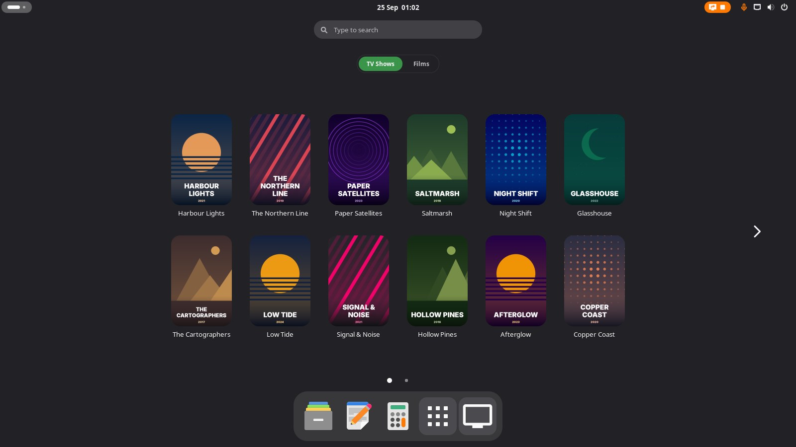
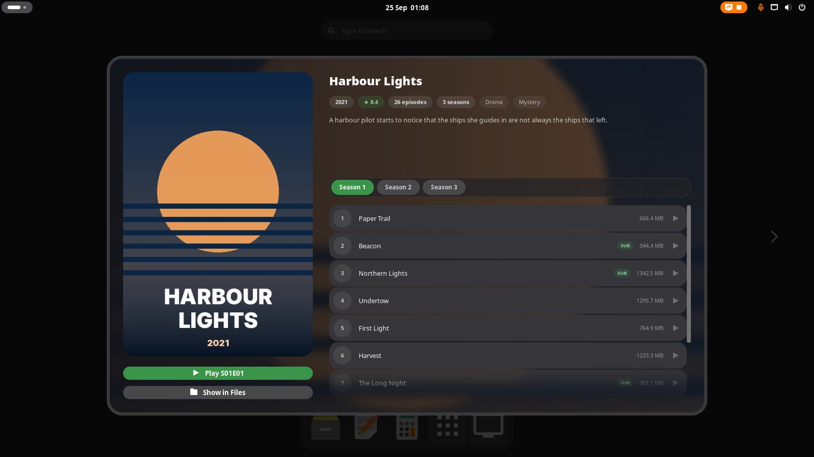
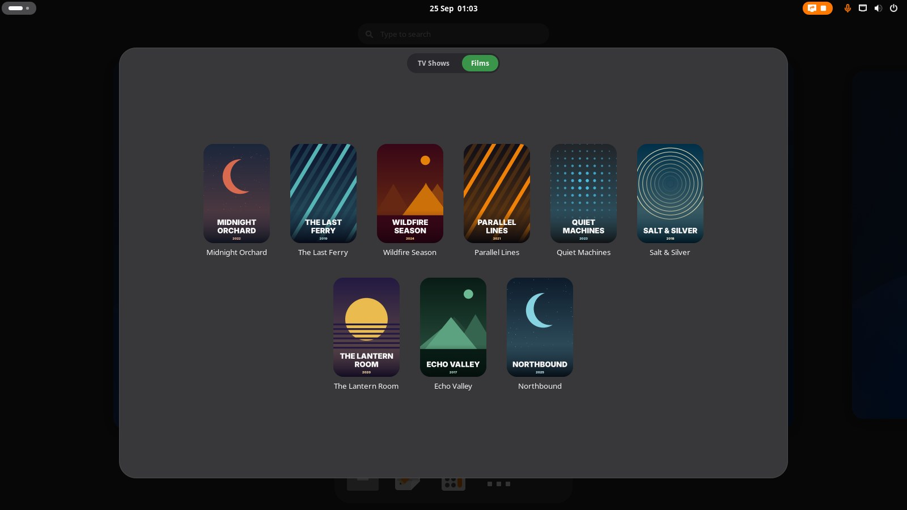
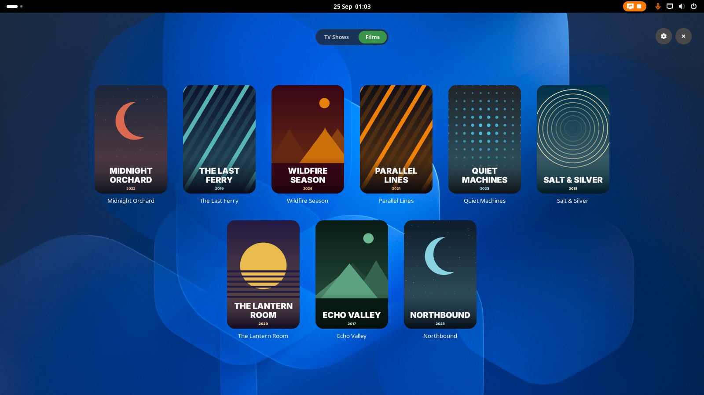
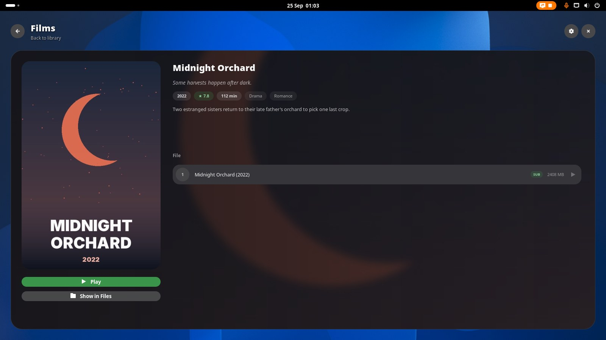
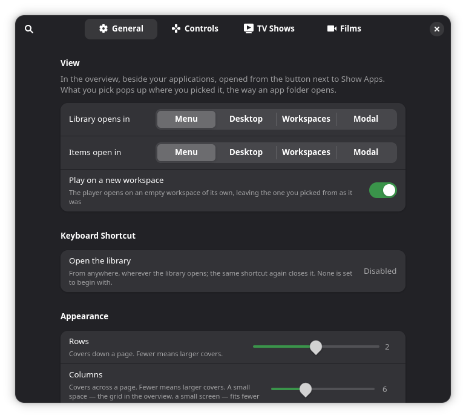
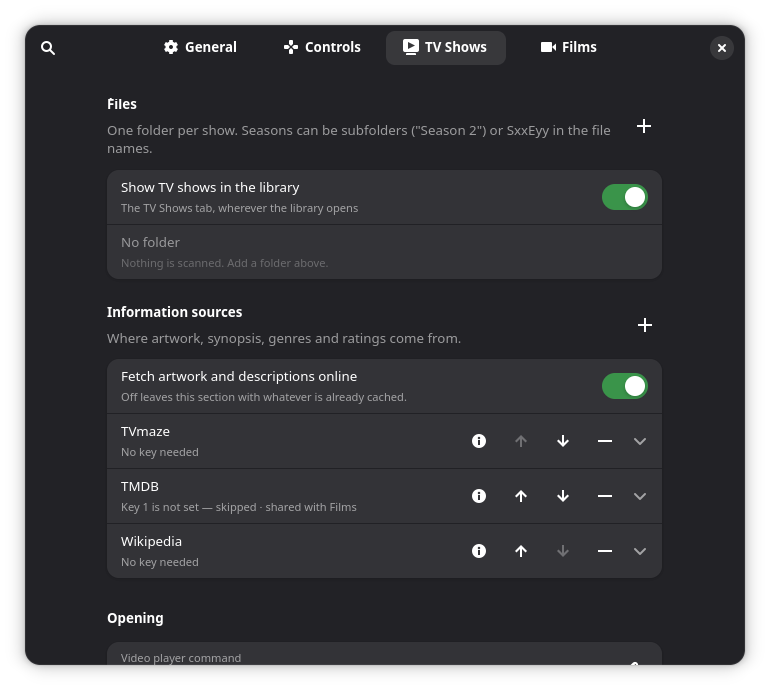
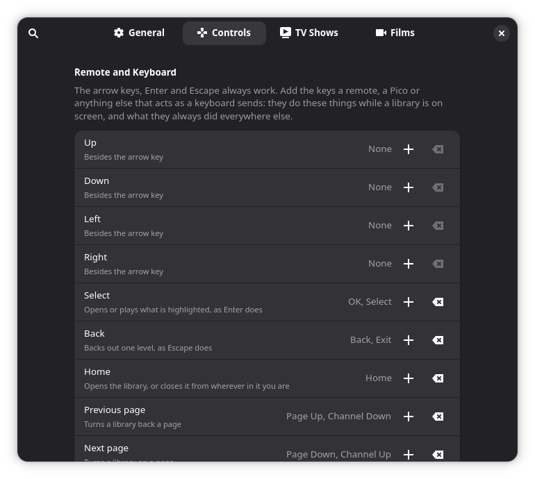

# Video Menu

Your own TV shows and films as a library in GNOME: posters, synopses, seasons
and episodes, opened from one button beside Show Apps. It doesn't play
anything itself. Pick an episode and it opens in VLC, mpv or whatever you use.



- **One button, two tabs.** TV Shows and Films, switched at the top. Turn a
  section off and its tab goes.
- **Finds the artwork.** Each title is looked up on TVmaze, TMDB and Wikipedia
  for its poster, backdrop, rating and synopsis, and cached so browsing stays
  instant.
- **Remembers what you've watched.** Tick an episode, or just play it, and
  Continue picks up where you left off.
- **Looks like GNOME.** The grid is the shell's own app grid, in your accent
  colour, with the same paging, swiping and keyboard.
- **Remote or controller.** Map a TV remote's keys or a game controller's
  buttons, and browse from the sofa.
- **Four places to open.** In the overview, in a pop-up panel, or right on the
  desktop.

## Install

Needs GNOME Shell 48, 49 or 50, and Python 3 for the folder scanner.

```bash
git clone https://github.com/Jackicus/GNOME-Video-Menu.git
cd GNOME-Video-Menu
make install
```

Log out and back in. GNOME only picks up a new extension when you log in.

Then open the preferences (`gnome-extensions prefs media-libraries@jackt`).
On the **TV Shows** and **Films** pages, add your folders and press
**Rescan**:

- **TV Shows:** one folder per show. Seasons can be subfolders (`Season 2`)
  or `S02E05` in the file names.
- **Films:** one folder or file per film, named `Title (Year)`.

TVmaze and Wikipedia work straight away. A free
[TMDB key](https://www.themoviedb.org/settings/api) adds backdrops, ratings
and taglines. It's stored in dconf in plain text, like any other setting.

## Where it opens

The **General** page chooses where the library opens and where a picked item
opens. The two settings are separate, so you can mix them.

| | The library | A picked item |
|---|---|---|
| **Menu** | In the overview, beside your apps | Pops up the way an app folder does |
| **Modal** | In a panel over the desktop | In a panel over everything |
| **Desktop** | On the wallpaper of the workspace you're on | In place of the grid |
| **Workspaces** | On a workspace of its own | On a workspace of its own |

<table>
  <tr>
    <td width="50%"></td>
    <td width="50%"></td>
  </tr>
  <tr>
    <td valign="top"><b>Menu</b>: a picked show pops up out of its poster.</td>
    <td valign="top"><b>Modal</b>: the library in a panel.</td>
  </tr>
  <tr>
    <td width="50%"></td>
    <td width="50%"></td>
  </tr>
  <tr>
    <td valign="top"><b>Desktop</b>: the library on the wallpaper.</td>
    <td valign="top"><b>Desktop</b>: a picked film in place of the grid.</td>
  </tr>
</table>

## Preferences

<table>
  <tr>
    <td width="33%"></td>
    <td width="33%"></td>
    <td width="33%"></td>
  </tr>
  <tr>
    <td valign="top"><b>General</b>: where things open, the keyboard shortcut,
    and the grid's size and shape.</td>
    <td valign="top"><b>TV Shows</b> and <b>Films</b>: folders, where the
    artwork comes from, and which player to use.</td>
    <td valign="top"><b>Controls</b>: keys and controller buttons for browsing
    from the sofa.</td>
  </tr>
</table>

## Troubleshooting

If the library doesn't show up, or a scan finds nothing, `make logs` shows
what went wrong.

## Development

```bash
make link      # install as a link to src/, for development
make reload    # apply your edits to the running shell, no logout needed
make nested    # start a throwaway nested GNOME Shell, mirrored in a window
```

`CLAUDE.md` explains how it's built. [`docs/`](docs/) covers the shell
internals it depends on, compatibility, and publishing.

---

<sub>The screenshots show a made-up library drawn by `scripts/demo_library.py`
(`./scripts/nested.sh start --clean --demo`). None of the shows or films are
real.</sub>
